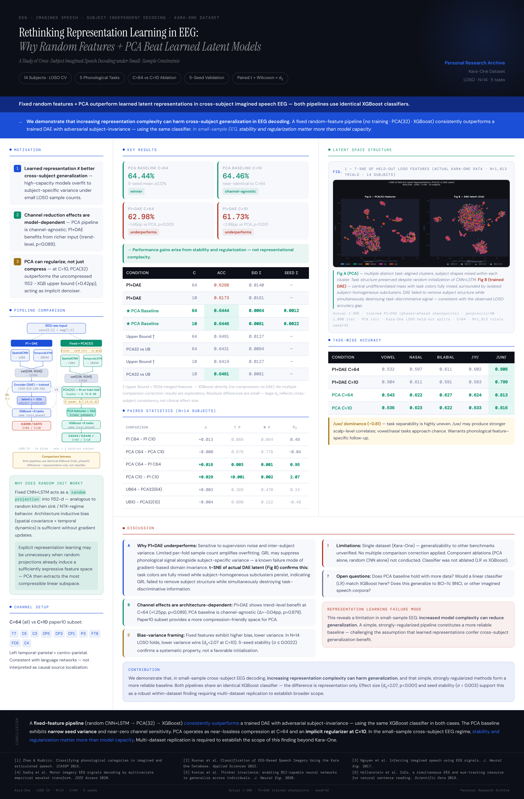

# Kara-One Subject-Independent Phonological Decoding


> **We demonstrate that a simple fixed-feature pipeline outperforms a learned latent manifold in cross-subject imagined speech EEG decoding — using identical XGBoost classifiers. In small-sample EEG, stability and regularization matter more than model capacity.**

---

## Poster

<p align="center">
  
</p>

> Full-resolution HTML poster: [`karaone_poster_final.html`](karaone_poster_final.html)

---

## Table of Contents

- [Overview](#overview)
- [Results](#results)
- [Pipelines](#pipelines)
- [Latent Space (t-SNE)](#latent-space-t-sne)
- [Dataset](#dataset)
- [Key Takeaways](#key-takeaways)
- [Usage](#usage)
- [File Structure](#file-structure)
- [Limitations](#limitations)
- [Future Directions](#future-directions)

---

## Overview

This project compares two EEG representation pipelines for **subject-independent phonological decoding** on the [Kara-One](http://www.cs.toronto.edu/~complingweb/data/karaOne/karaOne.html) imagined speech dataset under **Leave-One-Subject-Out (LOSO)** cross-validation.

The original goal was to build a subject-invariant learned representation. A PCA baseline was introduced as a sanity check — and unexpectedly became the main finding.

| | Pipeline A — PCA Baseline | Pipeline B — P1+DAE |
|---|---|---|
| Feature extractor | Random-init CNN+LSTM (frozen) | Trained CNN+LSTM + GRL |
| Dim. reduction | PCA(32), fit on train fold | DAE encoder (1152→32) |
| Classifier | XGBoost × 5 tasks | XGBoost × 5 tasks |
| Training required | **None** | Phase 1 + Phase 2 |

Both pipelines use the **same `train_phase3` XGBoost** — comparison is representation only.

---

## Results

### Accuracy by condition

| Condition | C | Mean Acc | SID σ | Seed σ |
|---|:-:|:-:|:-:|:-:|
| P1+DAE | 64 | 0.6298 | 0.0140 | — |
| P1+DAE | 10 | 0.6173 | 0.0161 | — |
| **PCA Baseline** | **64** | **0.6444** | 0.0064 | 0.0012 |
| **PCA Baseline** | **10** | **0.6446** | 0.0081 | 0.0022 |

### Paired statistics (N=14 subjects)

| Comparison | Δ | t p | Wilcoxon p | d_z |
|---|:-:|:-:|:-:|:-:|
| PCA C64 − P1 C64 | +0.016 | **0.003** | **0.001** | **0.95** |
| PCA C10 − P1 C10 | +0.029 | **<0.001** | **0.002** | **2.07** |
| PCA C64 − PCA C10 | −0.000 | 0.879 | 0.778 | −0.04 |

*No multiple comparison correction applied. Exploratory.*

### Upper-bound comparison (compression cost)

| Channel | 1152→XGB | PCA32→XGB | Gap | PCA ExpVar |
|---|:-:|:-:|:-:|:-:|
| C=64 | 0.6491 | 0.6431 | −0.006 (n.s.) | 0.786 |
| C=10 | 0.6419 | 0.6461 | **+0.004** | 0.898 |

At C=10, PCA(32) **outperforms** the uncompressed baseline → PCA acts as implicit regularizer.

---

## Pipelines

```
Pipeline A (PCA baseline)
  SpatialCNN (rand init, frozen) ─┐
                                   ├─ cat → 1152d → PCA(32) → XGBoost × 5 tasks
  TemporalLSTM (rand init, frozen) ┘

Pipeline B (P1+DAE)
  SpatialCNN (trained) ─┐
                          ├─ cat → 1152d → DAE encoder → 32d latent → XGBoost × 5 tasks
  TemporalLSTM (trained) ┘
        ↑ GRL (adversarial subject-invariance, λ→1)
```

---

## Latent Space (t-SNE)

Actual t-SNE of LOSO held-out features (N=1,913 trials · 14 subjects · C=64 · perplexity=30 · seed=42):

| Fig A — PCA(32) | Fig B — DAE latent (trained P1+P2) |
|---|---|
| Multiple task-aligned clusters | Central undifferentiated mass |
| Subject shapes mixed within clusters | Isolated subject-homogeneous subclusters |
| Task structure **preserved** | Task colors fully mixed → task signal **destroyed** |

DAE (Fig B): GRL failed to remove subject structure while simultaneously destroying task-discriminative signal — consistent with the observed accuracy gap.

---

## Dataset

- **Dataset**: [Kara-One](http://www.cs.toronto.edu/~complingweb/data/karaOne/karaOne.html)
- **Subjects**: 14 · **Eval**: LOSO CV · **Epoch type**: thinking
- **Tasks**: vowel / nasal / bilabial / /iy/ / /uw/ (5 binary)
- **Channels**: C=64 (all) vs C=10 (`paper10`: T7, C5, C3, CP5, CP3, CP1, P3, FT8, FC6, C4)
- **Seeds**: 0, 7, 13, 21, 42

---

## Key Takeaways

1. **Learned representation ≠ better cross-subject generalization** — high-capacity models overfit to subject-specific variance under small LOSO sample counts.

2. **Channel reduction effects are model-dependent** — PCA baseline is channel-agnostic; P1+DAE benefits from richer input.

3. **PCA can regularize, not just compress** — at C=10, PCA(32) outperforms uncompressed 1152→XGB baseline.

4. **Random projection may suffice** — fixed CNN+LSTM acts as a random projection into 1152-d (analogous to random kitchen sink / NTK-regime behavior). Architecture inductive bias is sufficient without gradient updates.

---

## Usage

### 1. Run PCA baseline (LOSO)

```python
# Kaggle
exec(open("train_pca_xgb.py").read())
df = run_loso_pca_xgb(channel_mode="all")      # C=64
df = run_loso_pca_xgb(channel_mode="paper10")  # C=10
```

### 2. Run upper-bound comparison

```python
exec(open("upper_bound_xgb.py").read())
df = run_upper_bound_comparison(channel_mode="all", seed=13)
```

### 3. Generate P1+DAE checkpoints

```python
exec(open("train_p1p2_checkpoints.py").read())
run_p1p2_checkpoints()               # all 14 SIDs
run_p1p2_checkpoints(sids=[0, 1])    # specific SIDs
```

### 4. Extract t-SNE

```python
# Requires phase1_best_sid{N}.pt + phase2_best_sid{N}.pt in CKPT_DIR
exec(open("extract_tsne_kaggle.py").read())
# → tsne_pca_dae.png, tsne_pca_dae_white.png
```

---

## File Structure

```
├── kara_one_dataset.py         # Dataset loader, LOSO splits, CCV preprocessing
├── model_manifold.py           # SpatialCNN, TemporalLSTM, EEGPhonologicalManifoldNet
├── train_stage2_manifold.py    # Phase 1/2/3 training pipeline
├── train_pca_xgb.py            # PCA baseline LOSO evaluation
├── upper_bound_xgb.py          # 1152d vs PCA(32) compression comparison
├── train_p1p2_checkpoints.py   # Generate P1+P2(DAE) checkpoints
└── extract_tsne_kaggle.py      # t-SNE of PCA vs DAE latent
```

---

## Limitations

- Single dataset (Kara-One) — generalizability unverified
- No multiple comparison correction applied
- Component ablations not conducted (PCA alone / random CNN alone / LR vs XGBoost)
- GRL disabled (`adv_weight=0`) during checkpoint generation for t-SNE

---

## Future Directions

- SHAP-based channel importance analysis
- `paper10 + α` channel subset search
- Validation on additional datasets (BCI-IV, BNCI)
- Transfer experiments to reading EEG (ZuCo)
- Integration as phonological submodule for EEG-to-Text systems

---

## Note

This project began as a personal research exploration. The PCA baseline was introduced as a sanity check and unexpectedly became the main finding. Not developed into a formal paper, but the empirical pattern is interpretable and may be useful for future work on robust EEG representation design.
